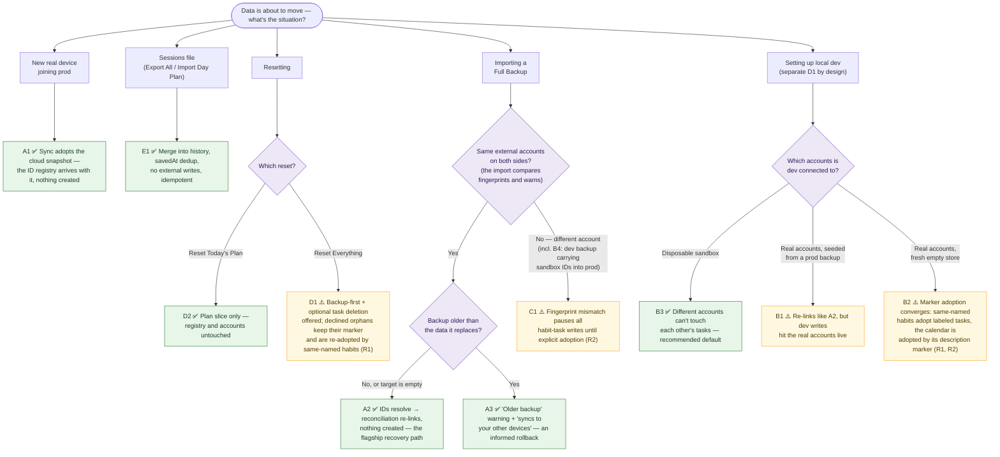

# Backup, import & restore — the scenario catalog

This is the feature-level tour of **moving Orchestrate data between installations**: what the backup/import/export/reset flows do, the guard mechanisms that keep transfers duplicate-free, and what happens in every realistic combination of backend and integration account. It exists because the flows themselves are simple, but their *consequences* depend entirely on which store and which external accounts are on each side of the transfer, and that matrix is easy to get wrong from memory.

Read [persistence.md](./persistence.md) first if you don't yet have the storage model (slices, the D1 sync sidecar, idempotent provisioning); this doc leans on it constantly and doesn't re-derive it. [backend.md](./backend.md) covers the identity/credential side. This doc's job is narrower: **the user-facing data-transfer features, scenario by scenario.**

A note on framing: throughout, "duplicate" means a duplicate **side-effect in an external account** (a second recurring habit task in Todoist, a second Orchestrate calendar in Google) — not duplicate rows in Orchestrate's own stores. The app-state side is whole-slice-authoritative everywhere and never merges, so it cannot duplicate *itself*; every hazard in this doc lives at the boundary with Todoist and Google Calendar.

---

## 1. The three axes that decide every scenario

Every scenario below is a point in a three-axis space. Internalize the axes and the catalog becomes predictable:

1. **Which installation (store)?** An installation = one origin + one browser profile: its own `localStorage`, its own view of a D1 database. Production (`*.pages.dev`), full-stack local dev (`wrangler pages dev` → local D1, `DEV_USER_EMAIL` identity), and UI-only dev (`npm run dev` — no Functions, sync passive, integrations disconnected) are all distinct installations.
2. **Which D1 database?** Installations that share a database (all your real devices on prod) **converge** through the sync sidecar — including the external-ID registry that prevents duplicates. Installations on separate databases (prod vs. local dev) never converge; a backup file is the only bridge.
3. **Which external accounts?** The Todoist and Google accounts the installation is *connected to*. This axis — not the database axis — is what decides whether duplicates are possible: external IDs carried in app-state only resolve against the account that minted them.

The one-sentence summary: **backup/import moves app-state faithfully across any of these boundaries; what it cannot move is the guarantee that the external IDs inside that state mean anything on the other side.** Two guard mechanisms (§2) cover the two ways that can go wrong — a *different account* on the other side (fingerprints pause and ask) and a *same account whose contents the store never met* (markers let it adopt instead of re-create).

---

## 2. The two guards, and the resolution ladder

Everything that keeps transfers duplicate-free hangs off two pieces of writable identity, one on each side of the store↔account boundary.

**Account fingerprints — "which accounts does this data belong to?"** `settings.todoistAccount` (Todoist user id+email, via `GET /user` through the proxy) and `settings.googleAccount` (the primary calendar's id, which *is* the account email) are stamped once at connect time when absent. Because they live in `settings`, they ride sync **and** backups automatically — one field, two checkpoints:

- **At import** (§3.3): the backup's fingerprints, origin host, and export age are compared against the live connections; each mismatch becomes an explicit warning in the confirm modal.
- **Before every auto-write**: the stored fingerprint is compared against the live account. On a mismatch **all habit-task writes halt** behind a red "account changed" chip/banner naming both accounts, whose only write path is an explicit *adopt this account* action (or reconnecting the original); Google's settings-prune and calendar auto-provision are gated the same way, with a notice + adopt affordance in Settings. Both integrations run one shared stamp/compare/adopt cycle ([`useAccountFingerprint`](../../src/hooks/useAccountFingerprint.ts)) whose verdict gates every writer — `ok`, `wait` (fingerprint stored but the identity fetch hasn't settled: writes hold rather than race it), or `blocked` (mismatch); a *failed* identity fetch degrades to ungated.

**Durable markers — "is this external object ours?"** Written into the external objects themselves, so they live in the *account* where any store can find them — the account-carried approximation of the registry, for stores that lack it:

- Every **habit task** carries two markers, split by role ([`habitsTodoistSync.ts`](../../src/lib/habitsTodoistSync.ts)):
  - the **`orchestrate-habit` label** — the *class* marker ("this task is ours"). One shared label across all habit tasks; write-once, preserving the user's other labels.
  - the **`[orchestrate:habit:<uuid>]` description token** — the *instance* marker (which habit, exactly). Backups carry habit uuids, so stores seeded from the same backup pair **exactly by token** — surviving renames and project moves. Corrected in place when stale, preserving the user's own description text.

  Both are stamped at creation and backfilled onto older linked tasks by the reconcile pass. The split is deliberate: instance identity can't live in a label (each distinct label name mints a permanent, never-garbage-collected personal label — one per habit), and a token alone would leave no fallback rung when a description is hand-edited.
- The **Orchestrate calendar** carries the **`orchestrate:managed-calendar` token in its description** — stamped at creation, re-stamped on rename, backfilled once per session onto the linked calendar. Best-effort: metadata patches can be denied on a calendar the app didn't create under the narrow `calendar.app.created` scope. See [`googleCalendarApi.ts`](../../src/lib/googleCalendarApi.ts).

**The resolution ladder everywhere is: id → marker adoption → create.** The stored id is primary — exact and rename-proof; creation happens only when every rung misses, and stamps the markers. Marker adoption differs per side because pairing differs:

- The **calendar is a singleton** — the marker alone identifies it, and it outranks a name match (a renamed Orchestrate calendar wins over a coincidentally "Orchestrate"-named one). The adopting store takes over the live name (the rename was the user's latest intent); same-name matching remains the last rung for pre-marker calendars.
- **Tasks are many** — pairing runs exact-first: uuid token (adopted outright, wherever it is), then label + exact name in the target project (the rung for pairs with no shared uuid: hand-recreated habits, pre-token tasks). Both rungs skip checked tasks and tasks another habit already claims.

**The guards' residuals, stated once** (the scenario verdicts below reference these rather than re-explaining):

- **R1 — Cross-store renames without a shared uuid.** Stores seeded from the same backup share habit uuids, so a rename is absorbed by the token rung. The residual is the pair that shares *no* uuid (hand-recreated habit, stripped/pre-token task) **and** no exact name: it pairs with nothing and creates a fresh task beside the old one. (Only wrong when it was meant to be the *same* habit; a genuinely new habit creating a new task is the intended behavior.)
- **R2 — Legacy data.** Pre-v7.11 objects carry no markers until the origin store runs one reconcile pass; pre-schema-7.7 backups/stores carry no fingerprints and no `_exportedAt` — their first account meeting behaves like the old ungated world, once, and the fingerprint is then stamped silently.
- **R3 — Strippable / fallible.** A user can remove the label or description line; the Todoist identity fetch can fail (gate inactive for the session); the calendar description patch can 403 (name-only matching remains the fallback).
- **R4 — Same-account resurrect: defused (v7.11).** The automatic pass can't tell "task lost, recreate it" from "task deliberately deleted in Todoist" — both read as a dangling id. So automatic passes are **adopt-only** for previously-linked habits: the benign rungs (id re-link, marker adoption) still heal, but a vanished task is never re-*created* silently — the habit surfaces as "missing" on the Habits page, where re-creation is explicit at either granularity: the **Re-sync** button (all missing), or the **recreate** action on each missing habit's chip (just that one). Declining is per-habit too: deactivate or delete the habit. Never-synced habits (no id ever) still auto-create — that's the feature, not a resurrect.

---

## 3. The flows, precisely

All flows live in [`DataManagement.tsx`](../../src/components/settings/DataManagement.tsx) (Settings → Data) and are shared with the Welcome page's [`RestoreModal`](../../src/components/RestoreModal.tsx) via the [`useDataImport`](../../src/hooks/useDataImport.ts) hook. Validation lives in [`dataImport.ts`](../../src/lib/dataImport.ts); the mutations are reducer actions in [`DayPlanContext.tsx`](../../src/context/DayPlanContext.tsx).

### 3.1 Full Backup (export)

One JSON download: `{ settings, life, history, currentDay?, _schemaVersion, _exportedAt, _originHost }` (built by [`backup.ts`](../../src/lib/backup.ts), shared by the Export button, the Reset Everything opt-in, and the restore confirm's backup-first opt-in). `currentDay` is the live working plan, included only when it has content — so a backup captures "today" even before it's saved to history. `_exportedAt` / `_originHost` record when and from which origin the file was taken; the account fingerprints (§2) ride inside `settings`. (The retired `_backupVersion` stamp is ignored on import — `_schemaVersion` is the only version gate, and a backup without `currentDay` simply leaves the plan slice untouched.)

**What's inside, by consequence:**

| Carried | Why it matters downstream |
|---|---|
| All of `settings` | The integration *references* (`habitsTodoistProjectId`, `orchestrateCalendarId`, `orchestrateCalendarName`, `googleCalendarIds`, the connected hint) **and the account fingerprints** (§2), plus onboarding flag and preferences. |
| All of `life` | Every habit's `todoistTaskId` / `todoistProjectId` — **the dedup registry** that decides create-vs-update on sync — plus backlog entries' linked-task `todoistId`s and the engagement archive. |
| `history`, `currentDay` | Saved and live plans, whose linked tasks carry `todoistId`s and whose plan may carry `sessionCalendarEventIds` (events in the origin account's calendar). |

**What's deliberately not inside:** credentials (server-side only), the identity stamp, the sync meta clock, the reset-pending markers, the Todoist cache, and device prefs (theme, music, Focus toggles). A backup is **data + references + provenance, never secrets or bookkeeping**.

### 3.2 Export All Sessions

A bare `SavedDayPlan[]` dump of `history`. No top-level schema stamp — each entry's `plan._schemaVersion` is the per-entry gate. Re-importable through Import Day Plan (§3.4). Carries linked-task `todoistId`s like everything else, but since saved sessions are read-only records, dangling IDs here degrade to `titleSnapshot` fallbacks rather than triggering any write.

### 3.3 Import Full Backup

The pipeline, in order ([`useDataImport.ts`](../../src/hooks/useDataImport.ts) → [`IMPORT_BACKUP`](../../src/context/DayPlanContext.tsx)):

1. **Parse + gate.** JSON parse → `validateBackup` classifies the file: a bare array is called out as a sessions export (wrong importer — a pointed message routes it to Import Day Plan); a non-backup shape is refused; a top-level `_schemaVersion` outside `[MIN_SUPPORTED_SCHEMA, SCHEMA_VERSION]` (the same numeric gate the loaders use — see [persistence.md §2.2](./persistence.md)) is refused with an explicit error, never partially applied.
2. **Validate shape.** Each carried slice is checked structurally; every `history` entry and `currentDay` is individually schema-gated. One malformed entry rejects the whole file (all-or-nothing).
3. **Provenance check.** The backup's fingerprints and origin host are compared against the live connections (or this store's own fingerprints when nothing is connected); `_exportedAt` is compared against the **newest local-change stamp** (the sync meta clock, which carries adopted-remote timestamps too, so it's correct on a freshly-synced device). A different Todoist account, a different Google account, a different origin host, or a backup >~5 minutes older than the live data each produce an explicit warning — the age warning spells out that the restore rolls everything back and syncs the rollback to other devices.
4. **Confirm — always.** The validated backup is parked and the shared confirm modal ([`RestoreConfirmModal`](../../src/components/RestoreConfirmModal.tsx)) runs on every import: *"This replaces your current … — a restore, not a merge, and it syncs to your other devices,"* plus the export timestamp, any warnings in amber, and a default-on **"download a Full Backup of this device's current data first"** opt-in — the same escape hatch Reset Everything offers, so a restore is always one file away from reversible.
5. **Replace.** Each slice **the backup carries** replaces the local one wholesale; absent slices are untouched. `life` is normalized (arrays defaulted, `activeSeasonId` validated, engagement archive pruned to its rolling window); `history` entries are floor-filtered and migrated; `currentDay` is migrated and **re-dated to today** so it becomes the active plan. The Todoist cache is cleared alongside, so pre-restore task rows can't render against the imported registry.
6. **Aftermath.** See §4 — the import is not done when the reducer returns.

Import semantics are deliberately **authoritative, not merge**: recovery means "make this installation look like the backup."

### 3.4 Import Day Plan

The one merge-flavoured import: accepts a single `SavedDayPlan` or an array (i.e. an Export All Sessions file), validates each entry, and prepends into `history` **deduped by `savedAt`**. Nothing is replaced, nothing external is touched, re-import is idempotent. Benign by construction.

### 3.5 Resets & Sign out

- **Reset Today's Plan** (`RESET_DAY`): replaces `plan` with a fresh one (sessions re-seeded from settings/defaults). Local to the plan slice; propagates through sync like any edit. Todoist untouched.
- **Sign out** ([`DataManagement.tsx`](../../src/components/settings/DataManagement.tsx) `handleSignOut`): the one **non-destructive** account action — it ends the Cloudflare Access session, not the data. It `flushPendingAndWait()`s unpushed edits up, then `clearLocalStores()` (the four slices + sync meta/reset-pending + Todoist cache, via [`cloudSync.ts`](../../src/lib/cloudSync.ts)), forgets the identity stamp (`setStoredUser('')`), and hard-redirects to the same-origin Access logout (`/cdn-cgi/access/logout`). **D1 rows and KV tokens are untouched** and return on next sign-in via the cold-start pull; the full-page redirect prevents any React re-persist, so the local clear is **never pushed as a wipe**. It clears local precisely because localStorage isn't namespaced by Access identity (§2's identity-switch guard is the same concern). Signing out then back in is the effective "reset just this device to match the server" operation. Contrast **Reset Everything**, which wipes the *server* copy and keeps you signed in — the two touch disjoint resources.
- **Reset Everything** (`RESET_ALL`): factory-resets all four slices and clears the Todoist cache. You **stay signed in** and integrations **stay connected** — server-side KV tokens are *not* touched (disconnect lives in Settings → Integrations), and the Access session is untouched. Because `defaultSettings()` clears `onboardingComplete`, the next `/` render **re-runs onboarding** (integrations already connected, so it clicks through). The confirm modal states that the wipe syncs to other devices and that habit tasks left behind become **orphans**, and offers two opt-ins:
  - **Download a Full Backup first** (default **on**) — the pre-wipe snapshot, since the wipe converges to every device sharing the database.
  - **Also delete the habit tasks Orchestrate created in Todoist** (default **off**; disabled when Todoist isn't connected or no habits are linked) — ids snapshotted before the wipe, deleted best-effort afterwards. Declining is fine too: the orphans keep their marker label, so re-creating same-named habits later *adopts* them (§2) rather than duplicating (scenario D1).

> **Minor asymmetry.** The ErrorBoundary's "Reset Day & Reload" is the only reset that also arms the reset-pending marker (`markLocalReset`) — Settings-initiated resets don't need it (no reload race), but it's worth knowing when reasoning about "why did my cleared slice come back."

---

## 4. What happens *after* an import — the aftermath chain

The modal describes the reducer's replace. Two automatic machines then act on the imported state.

**4a. The sync push.** Each persist effect fires with changed content → `notifyChanged` stamps the slice `Date.now()`, marks it dirty, and pushes (~2.5s debounce). The imported state **replaces the cloud copy for this database**, and every other device sharing it adopts it on its next cold-start pull. This rollback-by-restore is by design (LWW, import stamps "now") and is what the §3.3 age warning + "syncs to your other devices" copy make an *informed* choice; recovery from a confirmed mistake is D1 Time Travel or another backup file.

**4b. The reconciliation pass.** Detection recomputes immediately from the imported `life` against the current `taskMap`; the repair pass runs on the next trigger (focus / next load) — through the fingerprint gate and the resolution ladder of §2. In short: matching account → link-less habits adopt marked tasks before anything is created, and marker backfill runs (previously-linked habits whose task has vanished are **adopt-only** — re-creation waits for the explicit Re-sync, per R4); mismatched account → all writes pause behind the adopt-or-reconnect banner (an imported foreign registry arms the gate automatically, because the fingerprint rides inside the backup's `settings`); unverifiable → wait, then degrade to ungated only if the identity fetch fails outright.

The Google side is the same shape with smaller stakes: on a mismatch, `reconcileCalendarSettings` pruning and calendar auto-provision pause (notice + adopt in Settings); on a match, provisioning walks the §2 ladder, so even a renamed calendar is adopted rather than re-created. Dangling `sessionCalendarEventIds` simply go inert.

> (The Todoist cache is cleared at commit — §3.3 step 5 — so the pass runs against freshly-fetched tasks rather than a pre-restore snapshot. The write gate keys on fingerprints, not `taskMap` contents, so this is hygiene, not a guard.)

---

## 5. The scenario catalog

Verdict key: ✅ behaves well · ⚠️ works, with residuals from §2 to know about.

### The catalog at a glance

The two guards are complementary and the tree shows the split: **fingerprints** decide the cross-account branches (mismatch → pause and ask), **markers** decide the same-account ones (registry-less stores adopt instead of re-create). Every ⚠️ is a §2 residual, not a missing mechanism.

### The scenarios, one by one

Families follow the diagram: **A** same database + same accounts · **B** prod ↔ local dev (separate databases) · **C** a different account on either side · **D** resets · **E** sessions files.

| # | Scenario | What the mechanisms do | Verdict · residuals |
|---|---|---|---|
| **A1** | New device joins prod | No backup involved — sync is the cross-device mechanism. The cold-start pull adopts the cloud snapshot, the ID registry arrives with it, reconciliation finds every id present and does nothing. | ✅ |
| **A2** | Restore a backup after data loss (same accounts) | **The flagship recovery path.** The backup's `todoistTaskId`s and `orchestrateCalendarId` resolve in the connected account, so reconciliation **re-links instead of re-creating** — the reason backups carry IDs at all. | ✅ |
| **A3** | Restore an *old* backup onto live prod | Same mechanics as A2; the **"Older backup"** warning names both timestamps and the copy states the rollback syncs to every device — a deliberate rollback, never an accidental one. | ✅ · pre-7.7 backups skip the age warning (R2) |
| **B1** | Seed local dev from a prod backup (real accounts) | Registry + fingerprints arrive together; re-links like A2, nothing created. But **dev acts on the real accounts live**, and anything dev *originates* exists only in dev's registry — the markers let prod adopt it later instead of duplicating. | ⚠️ live writes to real accounts |
| **B2** | Fresh local dev (empty `life`) on the real accounts | Fingerprints match by construction, so the markers do the work: hand-recreated habits adopt by label + exact name (uuids differ here by construction); the calendar adopts by id or marker even if renamed. | ⚠️ R1, R2 |
| **B3** | Local dev on disposable sandbox accounts | Different accounts can't touch each other's objects. The sandbox fingerprint stamped in dev's settings is also what protects a later dev→prod crossing (B4). | ✅ recommended default |
| **B4** | Backup travels dev → prod | Same accounts (per B1): A2-safe but *replaces* prod's state — flagged by the `_originHost` (and possibly age) warning. Sandbox accounts (per B3): warned at import, and the imported sandbox fingerprint arms the C1 gate instead of mass-creating in real Todoist. | ⚠️ warned + gated |
| **C1** | Populated store meets a different Todoist account | Every habit reads as missing, but the fingerprint mismatch pauses all habit-task writes before the repair pass fires. The red banner offers reconnect-or-adopt; only an explicit re-sync after adopting populates the new account (the sandbox-populating flow, as opt-in). | ⚠️ R2, R3 |
| **C2** | Renamed Orchestrate calendar meets a store without the synced id | The marker rung outranks any name match, so the renamed calendar wins even against a coincidentally "Orchestrate"-named one; the adopting store takes over the live name. | ✅ · R3 (name-only fallback if the marker patch was denied) |
| **D1** | Reset Everything, then re-create the same habits | The modal offers a backup-first download and optional task deletion. Declined orphans keep their markers, so a habit re-created under the **same name** adopts its orphan. The wipe syncs to every device sharing the database — the offered backup is the recovery path. | ⚠️ R1 (a different name → fresh task beside the orphan) |
| **D2** | Reset Today's Plan | Plan slice only; habits, registry, and external accounts untouched. | ✅ |
| **E1** | Sessions export / Import Day Plan (any direction, any accounts) | Merge by `savedAt`, idempotent, no external writes; dangling ids degrade to `titleSnapshot` fallbacks. Safe *because* it neither replaces state nor feeds the reconciliation layer. | ✅ |

---

## 6. Remaining sharp edges

The residuals R1–R3 are defined in §2 (R4 was defused in v7.11 — automatic passes never re-create a previously-linked habit's task); beyond those, what's genuinely still open:

| Edge | Impact | Notes |
|---|---|---|
| **Cross-store renames (R1)** | A habit renamed in only one store can create a fresh task beside the old one | Only when no uuid token pairs them (hand-recreated habits, stripped tokens) — backup-seeded stores share uuids and pair exactly |
| **Legacy data (R2)** | Pre-v7.11 objects/backups get one unguarded first meeting | Self-resolving: fingerprints stamp at first connect, markers backfill on the first reconcile pass |
| **Backups are manual-only** | Every file-level recovery path depends on a recent export | Both destructive flows (Reset Everything, Import Full Backup) offer a pre-action download; the standing direction is per-slice D1 snapshots (see backlog) — file-sync was considered and dropped |

---

## See also

- [persistence.md](./persistence.md) — the storage model this doc stands on: slices, the sync sidecar's merge, local-vs-remote D1 (§4), idempotent provisioning and the guard mechanisms' home ground (§5.6), backup/restore mechanics (§7).
- [backend.md](./backend.md) — identity, the credential vault, and why tokens are never in a backup.
- [../data-model.md](../data-model.md) — entity semantics and the schema/migration rules the import gate enforces.
- [../roadmap/persistence_and_backend_migration.md](../roadmap/persistence_and_backend_migration.md) — the decision record behind the sync sidecar.
