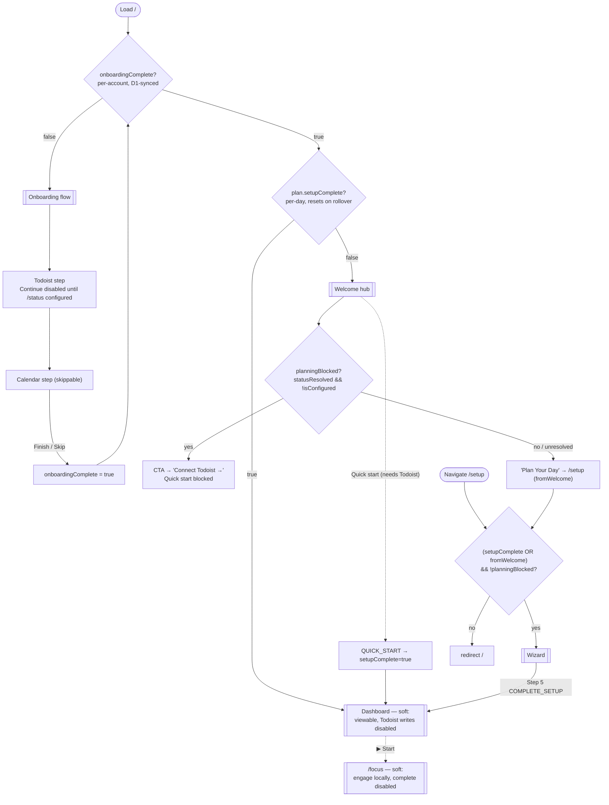

# Onboarding & entry gating

How Orchestrate decides what renders at `/`, when the first-run **onboarding flow** appears, and where the **integration requirement** (Todoist) is — and isn't — enforced. This is the routing-and-flags layer that sits in front of the daily loop.

The one thing to internalize: **onboarding and "integrations required" are two independent mechanisms.** Onboarding is a sticky, once-per-account *flag* (`settings.onboardingComplete`); the requirement is a *live connection-health signal* (`useTodoistGate`, §4). They intentionally don't reinforce each other — disconnecting Todoist never re-triggers onboarding, and completing onboarding doesn't mean Todoist is still connected. The requirement is enforced **app-wide** (banner + route guard + disabled writes), not only at the Welcome hub.

Entry code: [`src/App.tsx`](../../src/App.tsx) (route resolution + guards, banner mount), [`src/components/onboarding/Onboarding.tsx`](../../src/components/onboarding/Onboarding.tsx) (the flow), [`src/components/Welcome.tsx`](../../src/components/Welcome.tsx) (the hub CTA), [`src/hooks/useTodoistGate.ts`](../../src/hooks/useTodoistGate.ts) + [`src/components/ui/TodoistGateBanner.tsx`](../../src/components/ui/TodoistGateBanner.tsx) (the app-wide gate).

---

## 1. The two flags

| Flag | Type | Scope | Resets? | Set by |
|---|---|---|---|---|
| `settings.onboardingComplete` | persistent **settings** flag | per **account** (synced via D1) | never (one-time) | `finish()` in `Onboarding.tsx` — **Finish setup** or **Skip** on the calendar step (`UPDATE_SETTINGS`) |
| `plan.setupComplete` | per-day **plan** flag | per **day** | yes, on day rollover | `COMPLETE_SETUP` (wizard Step 5) or `QUICK_START` |

`onboardingComplete` gates the onboarding flow. `setupComplete` gates Dashboard-vs-Welcome and the wizard. Neither flag has any relationship to whether an integration is *actually connected* — that is a third, separate, **runtime** signal (`todoistConnected` / `statusResolved` from the Todoist `/status` check).

---

## 2. Entry resolution at `/`

`AppRoutes` resolves `/` in one expression ([`App.tsx`](../../src/App.tsx), the `/` route):

```
needsOnboarding ? <Onboarding /> : plan.setupComplete ? <Dashboard /> : <Welcome />
```

where `needsOnboarding = !settings.onboardingComplete`. So:

1. **`!onboardingComplete`** → **Onboarding** (first run, once per account).
2. **`onboardingComplete && setupComplete`** → **Dashboard** (a plan already exists for today).
3. **`onboardingComplete && !setupComplete`** → **Welcome** hub (plan the day).

Day rollover clears `setupComplete`, so the day after planning, `/` drops from Dashboard back to Welcome. `onboardingComplete`, being a settings flag, is untouched by rollover and by disconnecting integrations.

---

## 3. The onboarding flow (once per account)

`Onboarding.tsx` renders at `/` until `onboardingComplete` is set. Three steps, tracked in local component state (`intro → todoist → calendar`):

1. **Intro** — reuses `AboutContent`; explains that Todoist is required and Calendar is strongly recommended.
2. **Todoist** (required) — mounts the shared `TodoistConnectCard`. **Continue is disabled until `/status` reports configured** (`disabled={!todoistConnected}`); the label reflects the async check (`Checking…` → `Connect Todoist to continue` → `Continue`). This is the *only* place onboarding enforces the requirement.
3. **Calendar** (skippable) — mounts the shared `GoogleConnectCard` with `returnTo="home"`, so the Google consent redirect lands back at `/?gcal=…` and resumes on this step (the initial `step` state reads the `gcal` query param). Finishing **or skipping** calls `finish()`, which dispatches `onboardingComplete: true`.

Because steps auto-reflect already-connected integrations, an account whose integrations are already live clicks straight through. And because the flag syncs via D1, a fresh device for the same account **skips onboarding entirely** — it inherits `onboardingComplete: true`.

**Consequence:** once finished, onboarding never renders again on any device for that account, even if Todoist/Calendar are later disconnected or their server-side tokens are removed. The flag records "the user has been through setup once," not "integrations are currently connected."

---

## 4. The integration requirement (app-wide connection-health gate)

Planning is Todoist-driven (Orchestrate plans *from* Todoist tasks), so Todoist is a standing requirement. This is enforced **app-wide** — not by a single Welcome-hub CTA — through one shared signal and three cooperating pieces.

**The shared signal — [`useTodoistGate`](../../src/hooks/useTodoistGate.ts).** One hook off `useTodoistData()`, two thresholds, both keyed on `statusResolved` so an in-flight `/status` check renders neutrally (never flashes a block):

```
planningBlocked = statusResolved && !isConfigured                 // hard-block planning entry
writesBlocked   = statusResolved && (!isConfigured || authFailed) // banner + disable Todoist writes
```

`planningBlocked` is the definitively-unconfigured case. `writesBlocked` also covers a **revoked token** (`authFailed`) — configured, but a call 401'd — so a mid-day token lapse is caught too.

**The three enforcement points:**

1. **Persistent banner** ([`TodoistGateBanner`](../../src/components/ui/TodoistGateBanner.tsx)) — a non-dismissable top bar mounted once beside `AppRoutes` (inside `TodoistProvider`), so it shows on **every** surface (Welcome, Dashboard, wizard) while `writesBlocked`. Two messages: "Connect Todoist to plan your day" (never connected) or "Todoist disconnected — reconnect" (`authFailed`), each linking to `/settings?tab=integrations`. Transient sync *errors* stay in the bottom-right toast system; this bar is the standing *requirement*.
2. **Route guard** — `/setup` is `planningBlocked`-aware (§5), so the wizard can't be reached (or stayed in) while unconfigured.
3. **Disabled writes** — on the otherwise-soft Dashboard/Focus surfaces, the Todoist-*writing* controls (task completion, habit Complete/Skip) are `disabled` while `writesBlocked`. Engagement Start/Stop and timers stay live — they're local.

The **Welcome CTA** and **Quick Start** keep their own pre-existing `planningBlocked` gating (CTA swaps to "Connect Todoist →"; Quick Start shows a needs-Todoist panel).

**Google Calendar is never a gate** anywhere. In onboarding it is skippable; on Welcome it appears only as an informational "Connect →" chip.

---

## 5. Route guards

All routing lives in `AppRoutes` ([`App.tsx`](../../src/App.tsx)). Guards relevant to entry:

| Path | Element / guard | Integration-aware? |
|---|---|---|
| `/` | `Onboarding` / `Dashboard` / `Welcome` per §2 | No — flags only |
| `/setup` | `(plan.setupComplete \|\| fromWelcome) && !planningBlocked` ? `Wizard` : redirect `/` | **Yes** — `planningBlocked` (§4) |
| `/focus` | `plan.setupComplete` ? `FocusMode` : redirect `/` | No — **soft** (see §6) |
| everything else (`/life`, `/season`, `/habits`, `/settings`, `/guide`, …) | always reachable | No |

`fromWelcome` is router `location.state`, set only by Welcome's `goPlan` (`navigate('/setup', { state: { fromWelcome: true } })`). The `/setup` guard now also requires `!planningBlocked`, so an existing `setupComplete` (e.g. "Edit Plan" from the dashboard) no longer bypasses the requirement. Because `AppRoutes` re-renders on the Todoist context, this also **auto-redirects out of the wizard** if the token drops mid-planning — so no in-wizard guard is needed. `/focus` deliberately stays `setupComplete`-only: execution/engagement is local-first and worth keeping reachable even without Todoist (only its write controls disable — §6).

---

## 6. Hard-blocked vs. soft surfaces

The requirement distinguishes **planning** (impossible without Todoist) from **viewing/executing an existing plan** (valuable even during a token lapse):

- **Hard-blocked when `planningBlocked`:** the Welcome "Plan Your Day" CTA (swaps to "Connect Todoist →"), **Quick Start** (needs-Todoist panel), and the **`/setup` wizard** (route redirects to `/`). Planning is Todoist-driven, so a broken wizard is worse than a clear block.
- **Soft (viewable) behind the banner:** the **Dashboard** and **`/focus`** stay reachable when `writesBlocked`. You can see today's plan, read context, and run the engagement timer (all local). Only the Todoist-**writing** controls are disabled — task-completion checkboxes ([`SessionTimeline`](../../src/components/dashboard/SessionTimeline.tsx)), habit **Complete/Skip** ([`HabitInstanceCard`](../../src/components/dashboard/HabitInstanceCard.tsx)), and the Focus **Complete** button ([`FocusMode`](../../src/components/focus/FocusMode.tsx)) — each with a "reconnect Todoist" title. This avoids locking you out of an existing plan on a mid-day disconnect.

The banner (§4) is the constant across both: it shows on every surface while `writesBlocked`, so the state is never silent.

---

## 7. Account actions — onboarding re-entry, sign out, reset

Three deliberate account-level actions live in **Settings → Data** ([`DataManagement.tsx`](../../src/components/settings/DataManagement.tsx)). They touch **disjoint** resources:

| Action | Local slices | Server (D1 + KV) | Access session | Integrations | Onboarding |
|---|---|---|---|---|---|
| **Restart setup walkthrough** | untouched | untouched | kept | kept | re-runs (`onboardingComplete:false` + navigate `/`) |
| **Sign out** | **cleared** | untouched | **ended** | kept (KV tokens survive) | — |
| **Reset Everything** | wiped (defaults) | **wiped** (syncs to devices) | kept | kept (opt-in to delete habit tasks) | re-runs (settings reset) |

- **Restart setup walkthrough** just flips the sticky flag and navigates home; integrations stay connected so the steps click through fast. The deliberate re-entry replaces "you must disconnect to see onboarding again."
- **Sign out** ([`handleSignOut`](../../src/components/settings/DataManagement.tsx)) is non-destructive to the server: it `flushPendingAndWait()`s any unpushed edits, then `clearLocalStores()` (the four slices + sync meta + Todoist cache — localStorage isn't namespaced by account, so leaving it could bleed into the next Access user on a shared browser), forgets the identity stamp (`setStoredUser('')`), and hard-redirects to the same-origin Access logout (`/cdn-cgi/access/logout`). The full-page navigation prevents any React re-persist, so **no wipe is pushed** — data returns on next sign-in via the cold-start pull. Both `clearLocalStores` and `flushPendingAndWait` live in [`cloudSync.ts`](../../src/lib/cloudSync.ts).
- **Reset Everything** keeps you signed in and keeps integrations connected; it re-runs onboarding because `defaultSettings()` clears the flag. It's the only one that touches server data (the wipe syncs), so it offers a backup-first download. Full mechanics: [backup_and_restore.md §3.5](./backup_and_restore.md).

Signing out and back in is also the effective **"reset just this device to match the server"** operation — it clears local and re-hydrates from D1 — which is why Reset Everything has no separate local-only mode.

---

## 8. Flow diagram

The `writesBlocked` banner (§4) overlays every post-onboarding surface below while Todoist is unconfigured/revoked — omitted from the arrows for clarity.



---

## Related

- [synthesis.md §3.2](../synthesis.md) — routing table · [§5.0–5.1](../synthesis.md) — onboarding + Welcome lifecycle summary (this doc is the depth behind them).
- [reference/backend.md](./backend.md) — the `/status` endpoint, Cloudflare Access, and per-user KV credential vault behind `todoistConnected`.
- [reference/persistence.md](./persistence.md) — how `onboardingComplete` (a settings slice field) syncs across devices via D1.
- User-facing setup copy lives in the in-app flow itself ([`Onboarding.tsx`](../../src/components/onboarding/Onboarding.tsx)); type shapes in [`src/types/index.ts`](../../src/types/index.ts).
